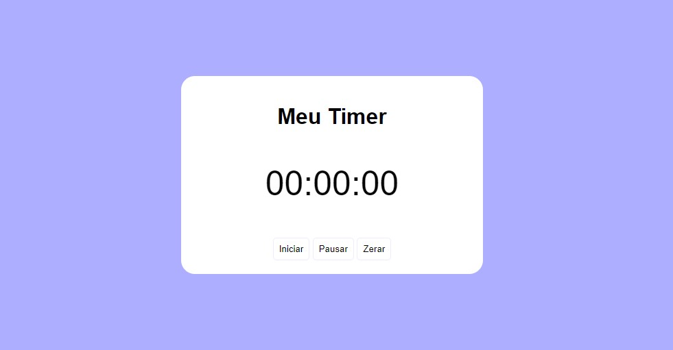

# Timer Simples
Este é um projeto de Timer simples desenvolvido com HTML, CSS e JavaScript. O Timer possui funcionalidades básicas, incluindo iniciar, pausar e zerar.

## Funcionalidades
- **Iniciar**: Inicia o timer a partir de um determinado tempo.
- **Pausar**: Pausa o timer, permitindo retomá-lo posteriormente a partir do momento em que foi pausado.
- **Zerar**: Reinicia o timer, configurando-o de volta para o tempo inicial.

  

  

